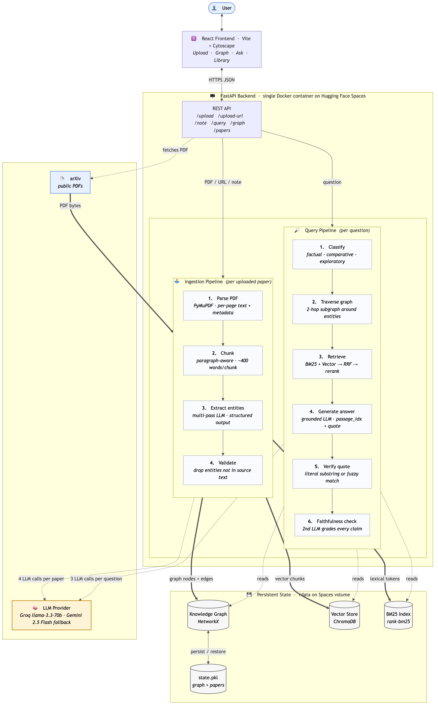

# PaperTrail: The Research Memory Agent

## Quick Setup (5 minutes)

### 1. Backend

```bash
# Create virtual environment
python -m venv venv
source venv/bin/activate  # On Windows: venv\Scripts\activate

# Install dependencies
pip install -r requirements.txt

# Set your Groq API key (or GEMINI_API_KEY as fallback)
export GROQ_API_KEY="gsk_your-key-here"
# Optional: pick a different Groq model
# export GROQ_MODEL="llama-3.1-8b-instant"

# Run the server
python main.py
```

Backend runs at `http://localhost:8000`

### 2. Frontend

The `frontend/` folder is a complete Vite + React app:

```bash
cd frontend
npm install
npm run dev
```

Vite will serve at `http://localhost:5173` and talk to the backend at `:8000`.

### 3. Demo Flow

1. Open `http://localhost:5173` in your browser
2. Go to **Upload** tab → upload 2-3 research PDFs
3. Switch to **Knowledge Graph** → show the auto-generated entity graph
4. Go to **Ask** tab → ask a cross-paper question like:
   - "What methods are used across these papers?"
   - "Which papers evaluate on the same datasets?"
   - "Compare the approaches used in my papers"
5. Show the cited answer with source references

## Architecture



```
PDF Upload → Text Extraction (PyMuPDF)
           → Entity Extraction (Groq llama-3.3-70b)
           → Knowledge Graph (NetworkX)
           → Vector Embeddings (ChromaDB)

Query → Vector Search (ChromaDB)
      → Graph Traversal (NetworkX)
      → Answer Generation (Groq llama-3.3-70b)
      → Cited Response
```

## API Endpoints

| Method | Endpoint | Description |
|--------|----------|-------------|
| POST | /upload | Upload and process a PDF |
| POST | /upload-url | Ingest a paper from a URL (e.g. arXiv) |
| POST | /note | Add a text note |
| POST | /query | Ask a question (GraphRAG) |
| GET | /papers | List all papers |
| GET | /papers/{paper_id} | Fetch a single paper |
| GET | /graph | Get knowledge graph (nodes + edges) |
| GET | /stats | System statistics |
| DELETE | /papers/{paper_id} | Delete a single paper |
| DELETE | /reset | Reset everything |

## Without an API Key

The system still works without an API key — it just skips entity extraction (no graph building) and uses only vector search for queries. For the demo, you really want the API key to show the full pipeline.

## Deployment (single container)

The included `Dockerfile` builds the frontend and serves it through the FastAPI
backend on a single port.

### Hugging Face Spaces (free, recommended)

1. Create a new Space → SDK: **Docker** (the README frontmatter already declares
   this so HF will pick it up automatically).
2. Push this repo to the Space.
3. In the Space's **Settings → Variables and secrets**, add `GROQ_API_KEY`.
4. Wait for the build. The app appears at `https://huggingface.co/spaces/<you>/<name>`.

### Render / Fly.io / Railway

Any "deploy from Dockerfile" provider works. Just set `GROQ_API_KEY` in the
service's environment. The container listens on `$PORT` (default 7860).

### Local Docker test

```bash
docker build -t papertrail .
docker run -p 7860:7860 -e GROQ_API_KEY=$GROQ_API_KEY papertrail
# open http://localhost:7860
```

> **Note**: ChromaDB and the knowledge graph are in-memory, so data is lost on
> restart. For persistence, mount a volume and switch ChromaDB to a persistent
> client (`chromadb.PersistentClient(path="/data/chroma")`).
